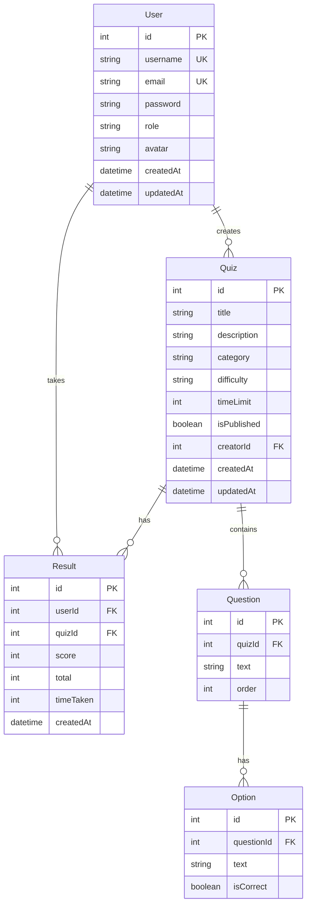

# 🧠 Quizzo — Full Project Analysis & Implementation Plan

> **Date:** March 7, 2026
> **Project:** Online Quiz Platform ("Quizzo")
> **Goal:** Transform a half-built prototype into a polished, production-ready quiz application.

---

## Table of Contents

1. [Project Overview & Current State](#1-project-overview--current-state)
2. [Deep-Dive: Issues & Code Audit](#2-deep-dive-issues--code-audit)
3. [Competitor Analysis](#3-competitor-analysis)
4. [Tech Stack Evaluation](#4-tech-stack-evaluation)
5. [Recommended Tech Stack](#5-recommended-tech-stack)
6. [Design System & Color Palette](#6-design-system--color-palette)
7. [Complete Feature Roadmap](#7-complete-feature-roadmap)
8. [Step-by-Step Implementation Plan](#8-step-by-step-implementation-plan)
9. [Database Schema Design](#9-database-schema-design)
10. [API Specification](#10-api-specification)
11. [Deployment Strategy](#11-deployment-strategy)

---

## 1. Project Overview & Current State

**Quizzo** is a web-based online quiz platform designed to allow users to register, log in, create quizzes, and take quizzes. It has two roles — **Admin** (quiz creators) and **User** (quiz takers).

### What Exists Today

The codebase currently has **two disconnected layers** in varying states of completion:

| Layer | Location | Status |
|---|---|---|
| **Legacy Layer** | Root (`server.js`, `*.html`) | ~60% functional, has critical bugs |
| **Modern Layer** | `backend/` + `frontend/` | ~15% built, scaffolding only |

#### Legacy Layer (Root)
- **`server.js`** — Express.js server with MySQL using raw SQL queries and callback-based patterns.
- **7 HTML pages** — `index.html` (login/signup), `admin.html`, `user.html`, `create_quiz.html`, `quiz-selection.html`, `take_quiz.html`, `view_quizzes.html`.
- **`setup_db.sql`** — MySQL schema with 3 tables (quizzes, questions, options) and sample data.
- **`check_db.js`** — Diagnostic script.

#### Modern Layer (backend/ + frontend/)
- **`backend/`** — Express 5 + TypeScript + Prisma ORM + PostgreSQL (Neon) + JWT + bcrypt. Has auth routes (`register`, `login`), quiz CRUD routes, and JWT middleware. Schema defines 5 models (User, Quiz, Question, Option, Result). **Partially functional.**
- **`frontend/`** — React 19 + Vite 8 + TypeScript. **Completely unbuilt** — still the default Vite+React boilerplate template (counter app).

---

## 2. Deep-Dive: Issues & Code Audit

### 🔴 Critical Issues

| # | Issue | File(s) | Severity |
|---|---|---|---|
| 1 | **Plain-text passwords** — Passwords are stored and compared as plain text (no hashing) | `server.js` L72, `update_admin.sql` | 🔴 Critical |
| 2 | **Broken PHP references** — Frontend calls `get_quizzes.php`, `get_quiz_details.php`, `submit_response.php` which don't exist | `user.html` L86, `take_quiz.html` L26, L54 | 🔴 Critical |
| 3 | **No authentication middleware** — Any user can access any page or API by navigating directly | `server.js` (entire file) | 🔴 Critical |
| 4 | **Manual ID generation** — Uses `SELECT MAX(id) + 1` which causes race conditions under concurrent requests | `server.js` L111, L150, L177, L200 | 🔴 Critical |
| 5 | **Hardcoded credentials in SQL** — Admin password `admin123` stored in plain text | `update_admin.sql` L6, `README.md` L57-58 | 🔴 Critical |
| 6 | **Exposed database credentials** — `.env` file with Neon connection string committed to repo | `backend/.env` L1 | 🔴 Critical |

### 🟡 Architectural Issues

| # | Issue | Details |
|---|---|---|
| 7 | **Callback hell** — Deeply nested callbacks (5+ levels) for quiz saving | `server.js` L139-243 |
| 8 | **No session/token management** — Login response is stored in `localStorage` with no expiry or validation | `index.html` L179 |
| 9 | **Role detection by email** — Admin role is assigned if email contains "admin" | `server.js` L117 |
| 10 | **Inconsistent endpoints** — `/api/save-quiz` vs `/get_quizzes` (no `/api` prefix) | `view_quizzes.html` L22 |
| 11 | **No input validation** — No sanitization or validation on any user input | All endpoints |
| 12 | **No error boundaries** — Uncaught errors crash the server | `server.js` |
| 13 | **Mixed concerns** — `admin.html` shows hardcoded quiz data, not from API | `admin.html` L62-76 |
| 14 | **No quiz timer implementation** — Timer field exists but is never used in quiz-taking | `take_quiz.html` |
| 15 | **No result history** — Legacy layer has no results/scoring storage | `setup_db.sql` (no results table) |

### 🟢 What the Modern Layer Gets Right

The partially-built `backend/` layer already addresses several issues correctly:
- ✅ **Password hashing** with bcrypt (salt rounds: 10)
- ✅ **JWT authentication** with middleware
- ✅ **Prisma ORM** eliminating raw SQL and auto-incrementing IDs
- ✅ **PostgreSQL** on Neon (cloud-hosted)
- ✅ **TypeScript** for type safety
- ✅ **Correct answer hiding** — `GET /api/quiz/:id` excludes `isCorrect` from options
- ✅ **Cascade delete** — Deleting a quiz deletes its questions, options, and results

---

## 3. Competitor Analysis

### Platform Comparison

| Feature | **Kahoot!** | **Quizizz** | **Typeform** | **Google Forms** | **Quizzo (Goal)** |
|---|---|---|---|---|---|
| Quiz Creation | ✅ Rich editor | ✅ Rich editor | ✅ Drag & drop | ✅ Basic | ✅ Dynamic form |
| Question Types | MCQ, T/F, Poll, Puzzle, Slider | MCQ, Fill-in, Poll, Open-ended | MCQ, Rating, Scale, Open | MCQ, Short, Long, Grid | MCQ, T/F, Fill-in |
| Live/Real-time | ✅ Core feature | ✅ Core feature | ❌ | ❌ | 🔮 Future (Socket.io) |
| Timer | ✅ Per-question | ✅ Per-quiz | ❌ | ❌ | ✅ Per-quiz |
| Leaderboard | ✅ Live | ✅ Live | ❌ | ❌ | ✅ Post-quiz |
| Result Analytics | ✅ Detailed | ✅ Detailed | ✅ Basic | ✅ Sheets integration | ✅ Dashboard |
| Mobile-Friendly | ✅ App | ✅ App | ✅ Responsive | ✅ Responsive | ✅ Responsive |
| Authentication | OAuth + Email | Google SSO | OAuth | Google account | JWT + Email |
| Gamification | Streaks, Points, Podium | Memes, Power-ups, Avatars | ❌ | ❌ | Streaks, Badges |

### Tech Stack Comparison

| Component | **Kahoot!** | **Quizizz** | **What Quizzo Should Use** |
|---|---|---|---|
| Frontend | React + TypeScript | React/Angular | **React 19 + TypeScript** |
| Backend | Java (microservices) | Node.js | **Node.js + Express + TypeScript** |
| Database | PostgreSQL | MongoDB + Cassandra + Redis | **PostgreSQL + Prisma ORM** |
| Real-time | WebSockets | WebSockets | **Socket.io** (future) |
| Search | Elasticsearch | Elasticsearch + Pinecone | **PostgreSQL full-text** (sufficient at scale) |
| Hosting | Google Cloud (GKE) | AWS | **Vercel + Neon** (cost-effective) |
| Auth | OAuth 2.0 | Google SSO | **JWT + bcrypt** (already started) |

### Key Takeaways from Competitors

1. **Conversational Flow** (Typeform) — One question at a time is more engaging than showing all questions at once.
2. **Instant Feedback** (Quizizz) — Show if the answer was correct immediately after selection with celebration/sad animations.
3. **Gamification** (Kahoot) — Timers create urgency, leaderboards create competition, streaks create habit.
4. **Rich Analytics** (All) — Users want to see their performance trends, not just a single score.

---

## 4. Tech Stack Evaluation

### Current Stack vs. Recommended

| Component | Legacy (Root) | Modern (backend/) | **Recommendation** |
|---|---|---|---|
| Language | JavaScript | TypeScript | ✅ **Keep TypeScript** |
| Backend | Express 4 | Express 5 | ✅ **Keep Express 5** |
| Database | MySQL (local) | PostgreSQL (Neon) | ✅ **Keep PostgreSQL + Neon** |
| ORM | Raw SQL | Prisma 7 | ✅ **Keep Prisma** |
| Auth | None / plaintext | JWT + bcrypt | ✅ **Keep JWT + bcrypt** |
| Frontend | Vanilla HTML/JS | React 19 + Vite 8 | ✅ **Keep, Build Out** |
| Styling | Inline CSS + Bootstrap CDN | None (boilerplate) | 🔄 **Add Vanilla CSS (custom design system)** |
| Routing (FE) | Page navigation (`.html`) | None | 🔄 **Add React Router v7** |
| State Mgmt | `localStorage` | None | 🔄 **Add Zustand** |
| Validation | None | None | 🔄 **Add Zod** |
| Notifications | `alert()` | None | 🔄 **Add React Hot Toast** |
| Icons | None | None | 🔄 **Add Lucide React** |
| Animations | None | None | 🔄 **Add Framer Motion** |

### Why Not Tailwind?

The existing plan recommended Tailwind CSS. However, for a project of this scope where **visual uniqueness matters**, Vanilla CSS provides:
- Full control over custom design tokens and animations
- No utility class bloat in JSX making components hard to read
- Better learning value — understanding CSS fundamentals
- The design system below is specific to Quizzo and wouldn't benefit from Tailwind's utility-first approach

---

## 5. Recommended Tech Stack (Final)

```
┌─────────────────────────────────────────────────────────┐
│                    QUIZZO TECH STACK                     │
├──────────────┬──────────────────────────────────────────┤
│ Frontend     │ React 19 + TypeScript + Vite 8           │
│ Styling      │ Vanilla CSS (custom design system)       │
│ Routing      │ React Router v7                          │
│ State        │ Zustand (global) + React Query (server)  │
│ Forms        │ React Hook Form + Zod                    │
│ Animations   │ Framer Motion                            │
│ Icons        │ Lucide React                             │
│ Toasts       │ React Hot Toast / Sonner                 │
├──────────────┼──────────────────────────────────────────┤
│ Backend      │ Node.js + Express 5 + TypeScript         │
│ ORM          │ Prisma 7                                 │
│ Database     │ PostgreSQL (Neon)                        │
│ Auth         │ JWT + bcrypt                             │
│ Validation   │ Zod (shared schemas)                     │
│ Real-time    │ Socket.io (Phase 4)                      │
├──────────────┼──────────────────────────────────────────┤
│ Deployment   │ Vercel (FE) + Render (BE) + Neon (DB)   │
│ CI/CD        │ GitHub Actions                           │
└──────────────┴──────────────────────────────────────────┘
```

---

## 6. Design System & Color Palette

### 🎨 "Nebula Dark" — Quizzo Design System

Inspired by modern futuristic quiz platforms with a deep space aesthetic, neon accents, and glassmorphism effects.

### Color Palette

```
┌─────────────────────────────────────────────────────────┐
│  NEBULA DARK — QUIZZO COLOR PALETTE                     │
├──────────────┬────────┬─────────────────────────────────┤
│ Role         │ Hex    │ Usage                           │
├──────────────┼────────┼─────────────────────────────────┤
│ Background   │ #0B0F1A│ Main app background             │
│ Surface      │ #141B2D│ Cards, modals, containers       │
│ Surface-2    │ #1C2539│ Elevated surfaces, sidebar      │
│ Border       │ #2A3450│ Subtle borders, dividers        │
├──────────────┼────────┼─────────────────────────────────┤
│ Primary      │ #6C5CE7│ CTAs, active states, focus      │
│ Primary-Glow │ #A78BFA│ Hover states, highlights        │
│ Accent       │ #00D2FF│ Links, info badges, icons       │
│ Accent-Warm  │ #F59E0B│ Warnings, streaks, timers       │
├──────────────┼────────┼─────────────────────────────────┤
│ Success      │ #10B981│ Correct answers, confirmations  │
│ Error        │ #EF4444│ Wrong answers, errors           │
│ Warning      │ #F59E0B│ Time running out, caution       │
├──────────────┼────────┼─────────────────────────────────┤
│ Text-Primary │ #F1F5F9│ Headings, primary text          │
│ Text-Second. │ #94A3B8│ Descriptions, metadata          │
│ Text-Muted   │ #475569│ Placeholders, disabled          │
├──────────────┼────────┼─────────────────────────────────┤
│ Gradient-1   │ #6C5CE7 → #00D2FF │ Primary gradient     │
│ Gradient-2   │ #6C5CE7 → #EC4899 │ Quiz/gamification    │
│ Gradient-3   │ #0B0F1A → #141B2D │ Background depth     │
└──────────────┴────────┴─────────────────────────────────┘
```

### Typography

```css
/* Primary: Inter — clean, modern, excellent readability */
/* Heading: Space Grotesk — techy, futuristic feel */

@import url('https://fonts.googleapis.com/css2?family=Inter:wght@400;500;600;700&family=Space+Grotesk:wght@500;600;700&display=swap');

--font-heading: 'Space Grotesk', sans-serif;
--font-body: 'Inter', sans-serif;
```

### Design Effects

| Effect | Implementation | Where Used |
|---|---|---|
| **Glassmorphism** | `backdrop-filter: blur(16px); background: rgba(20, 27, 45, 0.7);` | Cards, modals, nav |
| **Neon Glow** | `box-shadow: 0 0 20px rgba(108, 92, 231, 0.3);` | Active buttons, correct answer highlights |
| **Micro-animations** | Framer Motion `spring` transitions | Page transitions, card hovers, answer selection |
| **Gradient Borders** | `border-image: linear-gradient(135deg, #6C5CE7, #00D2FF) 1;` | Featured quiz cards |
| **Particle BG** | Subtle floating dots on landing page | Login/landing page only |
| **Skeleton Loading** | Pulsing `#1C2539 → #2A3450` | Data loading states |

---

## 7. Complete Feature Roadmap

### Phase 1 — Core Foundation 🏗️
- [x] Project structure (backend + frontend separation)
- [x] Database schema (Prisma)
- [x] User registration & login (JWT + bcrypt)
- [ ] Protected routes (backend middleware)
- [ ] Frontend auth pages (Login, Register)
- [ ] JWT storage & auto-refresh
- [ ] Role-based route guards

### Phase 2 — Quiz Engine 🧩
- [ ] Create Quiz page (multi-step form)
- [ ] Dynamic question + option management
- [ ] Quiz listing page (card grid)
- [ ] Quiz detail / preview page
- [ ] Quiz-taking interface (one question at a time)
- [ ] Countdown timer (per quiz)
- [ ] Answer submission & scoring
- [ ] Results screen with correct/incorrect breakdown
- [ ] Edit & Delete quiz (admin only)

### Phase 3 — User Experience ✨
- [ ] User dashboard (recent quizzes, stats)
- [ ] Admin dashboard (quiz management, user stats)
- [ ] Result history & performance trends
- [ ] Leaderboard (per quiz and global)
- [ ] Search & filter quizzes (by category, difficulty)
- [ ] Quiz categories & tags
- [ ] Profile page with avatar

### Phase 4 — Advanced Features 🚀
- [ ] Live multiplayer quiz (Socket.io)
- [ ] Quiz sharing via unique code/link
- [ ] Import questions from CSV/JSON
- [ ] True/False and Fill-in question types
- [ ] Difficulty levels (Easy, Medium, Hard)
- [ ] Gamification (streaks, badges, XP)
- [ ] Email notifications (quiz results, invites)

---

## 8. Step-by-Step Implementation Plan

### 📋 Phase 1: Backend Completion & Auth (Days 1–3)

#### Step 1.1 — Clean Up Project Structure
```
Online-Quiz-Platform/
├── backend/                   # ← All backend code here
│   ├── src/
│   │   ├── index.ts           # Express app entry point
│   │   ├── db.ts              # Prisma client
│   │   ├── middleware/
│   │   │   └── auth.ts        # JWT verification middleware
│   │   ├── routes/
│   │   │   ├── auth.ts        # /api/auth/* routes
│   │   │   └── quiz.ts        # /api/quiz/* routes
│   │   ├── validators/
│   │   │   ├── auth.ts        # Zod schemas for auth
│   │   │   └── quiz.ts        # Zod schemas for quiz
│   │   └── utils/
│   │       └── errors.ts      # Custom error handler
│   ├── prisma/
│   │   └── schema.prisma      # Database schema
│   ├── .env                   # Environment variables
│   ├── package.json
│   └── tsconfig.json
│
├── frontend/                  # ← All frontend code here
│   ├── src/
│   │   ├── main.tsx
│   │   ├── App.tsx
│   │   ├── index.css          # Global design system
│   │   ├── pages/             # Route-level components
│   │   ├── components/        # Reusable UI components
│   │   ├── hooks/             # Custom React hooks
│   │   ├── stores/            # Zustand stores
│   │   ├── services/          # API call functions
│   │   ├── types/             # TypeScript interfaces
│   │   └── utils/             # Helper functions
│   ├── package.json
│   └── vite.config.ts
│
├── .gitignore                 # Root gitignore (ignore .env, node_modules, dist)
└── README.md
```

**Actions:**
1. Delete all legacy root files: `server.js`, `check_db.js`, `setup_db.sql`, `update_admin.sql`, `*.html`, root `package.json`, root `package-lock.json`, root `.env`, root `node_modules/`.
2. Move root `.gitignore` rules into backend and frontend `.gitignore`.
3. Ensure `backend/.env` is in `.gitignore` (rotate the exposed Neon credentials!).

#### Step 1.2 — Enhance Prisma Schema

Update `backend/prisma/schema.prisma` to add:

```prisma
model User {
  id        Int      @id @default(autoincrement())
  username  String   @unique
  email     String   @unique             // ← ADD
  password  String
  role      String   @default("user")
  avatar    String?                      // ← ADD (URL or base64)
  quizzes   Quiz[]   @relation("QuizCreator")
  results   Result[]
  createdAt DateTime @default(now())
  updatedAt DateTime @updatedAt          // ← ADD
}

model Quiz {
  id          Int        @id @default(autoincrement())
  title       String
  description String?
  category    String?                    // ← ADD
  difficulty  String     @default("medium") // ← ADD (easy/medium/hard)
  timeLimit   Int        @default(600)   // ← ADD (seconds)
  isPublished Boolean    @default(false) // ← ADD (draft system)
  creatorId   Int
  creator     User       @relation("QuizCreator", fields: [creatorId], references: [id])
  questions   Question[]
  results     Result[]
  createdAt   DateTime   @default(now())
  updatedAt   DateTime   @updatedAt      // ← ADD
}

// Question, Option, Result models remain similar with `updatedAt` added
```

**Actions:**
1. Add `email` (unique), `avatar`, `updatedAt` to `User`.
2. Add `category`, `difficulty`, `timeLimit`, `isPublished`, `updatedAt` to `Quiz`.
3. Run `npx prisma migrate dev --name enhance_schema`.

#### Step 1.3 — Add Input Validation with Zod

Create `backend/src/validators/auth.ts`:
```typescript
import { z } from 'zod';

export const registerSchema = z.object({
  username: z.string().min(3).max(30),
  email: z.string().email(),
  password: z.string().min(6).max(100),
});

export const loginSchema = z.object({
  email: z.string().email(),
  password: z.string().min(1),
});
```

Create `backend/src/validators/quiz.ts`:
```typescript
import { z } from 'zod';

export const createQuizSchema = z.object({
  title: z.string().min(1).max(200),
  description: z.string().optional(),
  category: z.string().optional(),
  difficulty: z.enum(['easy', 'medium', 'hard']).default('medium'),
  timeLimit: z.number().int().min(30).max(3600).default(600),
  questions: z.array(z.object({
    text: z.string().min(1),
    options: z.array(z.object({
      text: z.string().min(1),
      isCorrect: z.boolean(),
    })).min(2).max(6),
  })).min(1),
});
```

#### Step 1.4 — Refactor Auth Routes

Update registration to accept email, add proper error handling:
```typescript
// POST /api/auth/register
// - Accept: { username, email, password }
// - Validate with Zod
// - Hash password with bcrypt
// - Return JWT token + user object

// POST /api/auth/login
// - Accept: { email, password }  ← change from username to email
// - Validate with Zod
// - Compare with bcrypt
// - Return JWT token + user object

// GET /api/auth/me (NEW)
// - Requires JWT middleware
// - Returns current user profile from token
```

#### Step 1.5 — Enhance Quiz Routes

```typescript
// POST   /api/quiz           — Create quiz (auth required, admin only)
// GET    /api/quiz            — List all published quizzes (public)
// GET    /api/quiz/:id        — Get single quiz (hide correct answers)
// PUT    /api/quiz/:id        — Update quiz (auth, owner only)
// DELETE /api/quiz/:id        — Delete quiz (auth, owner only)
// POST   /api/quiz/:id/submit — Submit answers (auth required)
// GET    /api/quiz/:id/results — Get results for a quiz (auth, owner or participant)

// GET /api/user/results       — Get current user's all results (auth required)
// GET /api/leaderboard        — Get global leaderboard (public)
// GET /api/leaderboard/:quizId — Get quiz-specific leaderboard (public)
```

---

### 📋 Phase 2: Frontend — Auth & Layout (Days 4–7)

#### Step 2.1 — Install Dependencies
```bash
cd frontend
npm install react-router-dom zustand @tanstack/react-query
npm install react-hook-form @hookform/resolvers zod
npm install framer-motion lucide-react sonner
npm install axios
```

#### Step 2.2 — Design System (CSS Custom Properties)

Create `frontend/src/index.css` with the complete Nebula Dark design system:
```css
:root {
  /* Colors */
  --bg:          #0B0F1A;
  --surface:     #141B2D;
  --surface-2:   #1C2539;
  --border:      #2A3450;

  --primary:     #6C5CE7;
  --primary-glow:#A78BFA;
  --accent:      #00D2FF;
  --accent-warm: #F59E0B;

  --success:     #10B981;
  --error:       #EF4444;
  --warning:     #F59E0B;

  --text:        #F1F5F9;
  --text-secondary: #94A3B8;
  --text-muted:  #475569;

  /* Typography */
  --font-heading: 'Space Grotesk', sans-serif;
  --font-body: 'Inter', sans-serif;

  /* Spacing */
  --space-xs: 4px;
  --space-sm: 8px;
  --space-md: 16px;
  --space-lg: 24px;
  --space-xl: 32px;
  --space-2xl: 48px;

  /* Radius */
  --radius-sm: 8px;
  --radius-md: 12px;
  --radius-lg: 16px;
  --radius-full: 9999px;

  /* Shadows */
  --shadow-sm: 0 2px 8px rgba(0, 0, 0, 0.3);
  --shadow-md: 0 4px 16px rgba(0, 0, 0, 0.4);
  --shadow-glow: 0 0 20px rgba(108, 92, 231, 0.3);

  /* Transitions */
  --ease: cubic-bezier(0.4, 0, 0.2, 1);
  --duration: 200ms;
}
```

#### Step 2.3 — Routing Structure

```typescript
// App.tsx — Route definitions
<Routes>
  {/* Public Routes */}
  <Route path="/login" element={<LoginPage />} />
  <Route path="/register" element={<RegisterPage />} />

  {/* Protected Routes (require auth) */}
  <Route element={<ProtectedRoute />}>
    <Route element={<AppLayout />}>
      <Route path="/" element={<DashboardPage />} />
      <Route path="/quizzes" element={<QuizListPage />} />
      <Route path="/quiz/:id" element={<QuizDetailPage />} />
      <Route path="/quiz/:id/take" element={<QuizTakePage />} />
      <Route path="/quiz/:id/results" element={<QuizResultsPage />} />
      <Route path="/leaderboard" element={<LeaderboardPage />} />
      <Route path="/profile" element={<ProfilePage />} />
      <Route path="/history" element={<HistoryPage />} />

      {/* Admin-only Routes */}
      <Route element={<AdminRoute />}>
        <Route path="/create-quiz" element={<CreateQuizPage />} />
        <Route path="/edit-quiz/:id" element={<EditQuizPage />} />
        <Route path="/admin" element={<AdminDashboardPage />} />
      </Route>
    </Route>
  </Route>

  <Route path="*" element={<NotFoundPage />} />
</Routes>
```

#### Step 2.4 — Core Components to Build

```
components/
├── layout/
│   ├── AppLayout.tsx          # Sidebar + main content + topbar
│   ├── Sidebar.tsx            # Navigation sidebar (glassmorphism)
│   └── TopBar.tsx             # User avatar, search, notifications
├── auth/
│   ├── LoginForm.tsx          # Email + password login form
│   ├── RegisterForm.tsx       # Username + email + password form
│   └── ProtectedRoute.tsx     # JWT check, redirect to /login
├── quiz/
│   ├── QuizCard.tsx           # Card displaying quiz info (grid item)
│   ├── QuizForm.tsx           # Multi-step quiz creation form
│   ├── QuestionEditor.tsx     # Single question + options editor
│   ├── QuizPlayer.tsx         # One-question-at-a-time quiz interface
│   ├── Timer.tsx              # Countdown timer with visual progress
│   └── ResultCard.tsx         # Score display with breakdown
├── ui/
│   ├── Button.tsx             # Primary, secondary, ghost variants
│   ├── Input.tsx              # Form input with label + error
│   ├── Card.tsx               # Glassmorphism card container
│   ├── Badge.tsx              # Category/difficulty badges
│   ├── Modal.tsx              # Overlay modal
│   ├── Skeleton.tsx           # Loading skeleton
│   └── EmptyState.tsx         # "No data" illustration
└── common/
    ├── Logo.tsx               # Quizzo logo component
    ├── Avatar.tsx             # User avatar with fallback
    └── ProgressBar.tsx        # Quiz progress indicator
```

#### Step 2.5 — Build Auth Pages

**Login Page:**
- Glassmorphism card centered on gradient background
- Email + password inputs with validation
- "Remember me" toggle
- Link to Register
- Error toasts on failure
- Redirect to dashboard on success

**Register Page:**
- Same card layout
- Username + email + password + confirm password
- Password strength indicator
- Link to Login

---

### 📋 Phase 3: Quiz Engine (Days 8–14)

#### Step 3.1 — Quiz Creation Page (Admin)

A **multi-step form** with:

| Step | Content |
|---|---|
| 1. Basics | Title, description, category dropdown, difficulty selector |
| 2. Questions | Dynamic list — add/remove/reorder questions with drag |
| 3. Settings | Time limit slider, publish toggle |
| 4. Review | Preview all questions before saving |

Each question card has:
- Question text input
- 2–6 option inputs (add/remove)
- Radio button to mark correct option
- Delete question button

#### Step 3.2 — Quiz Listing Page

- Grid of `QuizCard` components
- Filter bar: category, difficulty, sort by (newest, popular)
- Search input
- Each card shows: title, category badge, difficulty badge, question count, creator name
- Click navigates to quiz detail

#### Step 3.3 — Quiz Detail Page

- Full quiz info (title, description, creator, stats)
- "Start Quiz" CTA button
- "Leaderboard" tab showing top scores
- If admin/owner: "Edit" and "Delete" buttons

#### Step 3.4 — Quiz Player (Core Experience)

The most important UX — showing **one question at a time** (Typeform-style):

```
┌─────────────────────────────────────────────┐
│  ⏱ 04:32                    Q 3 of 10       │
│  ▓▓▓▓▓▓▓▓▓▓▓░░░░░░░░░░░░  30%              │
│                                              │
│         What is the capital of Japan?        │
│                                              │
│    ┌─────────────────────────────────┐       │
│    │  A) Beijing                     │       │
│    └─────────────────────────────────┘       │
│    ┌─────────────────────────────────┐       │
│    │  B) Seoul                       │       │
│    └─────────────────────────────────┘       │
│    ┌─────────────────────────────────┐       │
│    │  C) Tokyo                   ✓   │  ← selected
│    └─────────────────────────────────┘       │
│    ┌─────────────────────────────────┐       │
│    │  D) Bangkok                     │       │
│    └─────────────────────────────────┘       │
│                                              │
│                      [Next →]                │
└─────────────────────────────────────────────┘
```

**Key UX Details:**
- Progress bar at top (gradient fill)
- Timer in top-left (turns red when < 30s)
- One question per screen with smooth slide animation
- Option cards highlight on selection with glow effect
- "Next" button appears after selecting an option
- Auto-submit when timer reaches 0
- Keyboard navigation (1-4 keys for options, Enter for next)

#### Step 3.5 — Results Screen

After submission, display:
- **Score** (large, animated number counting up)
- **Percentage** with circular progress ring
- **Grade** (A+, A, B, C, D, F with color coding)
- **Breakdown** — list of questions showing correct/incorrect with your answer vs correct answer
- **Time taken**
- **"Quiz Again"** and **"Back to Quizzes"** buttons
- **Share result** as an image or link

---

### 📋 Phase 4: Polish & Advanced Features (Days 15–21)

#### Step 4.1 — User Dashboard
- Welcome message with user avatar
- Stats cards: Total quizzes taken, Average score, Current streak
- Recent activity (last 5 quiz results)
- Quick access to popular quizzes

#### Step 4.2 — Admin Dashboard
- Stats: Total quizzes created, Total attempts across all quizzes, Average score
- Quiz management table (edit, delete, publish/unpublish)
- Recent submissions feed

#### Step 4.3 — Leaderboard
- Global top 20 scorers (by total points)
- Per-quiz leaderboard
- User's rank highlighted
- Animated entries with Framer Motion

#### Step 4.4 — Quiz History
- Table of all quizzes the user has taken
- Columns: Quiz title, Score, Date, Time taken
- Click to view detailed breakdown

#### Step 4.5 — Profile Page
- Avatar upload
- Username and email display
- Change password form
- Account stats summary

#### Step 4.6 — Final Polish
- Loading skeletons on all data-fetching pages
- Error boundaries with retry buttons
- 404 page with fun illustration
- Responsive design (mobile-first)
- Keyboard accessibility
- SEO meta tags
- Favicon and PWA manifest

---

## 9. Database Schema Design

### Entity-Relationship Diagram



---

## 10. API Specification

### Authentication Endpoints

| Method | Endpoint | Auth | Description |
|---|---|---|---|
| `POST` | `/api/auth/register` | ❌ | Create new user account |
| `POST` | `/api/auth/login` | ❌ | Login, returns JWT token |
| `GET` | `/api/auth/me` | ✅ | Get current user profile |
| `PUT` | `/api/auth/profile` | ✅ | Update profile (username, avatar) |
| `PUT` | `/api/auth/password` | ✅ | Change password |

### Quiz Endpoints

| Method | Endpoint | Auth | Description |
|---|---|---|---|
| `POST` | `/api/quiz` | ✅ Admin | Create new quiz |
| `GET` | `/api/quiz` | ❌ | List published quizzes (with filters) |
| `GET` | `/api/quiz/:id` | ❌ | Get quiz detail (hides answers) |
| `PUT` | `/api/quiz/:id` | ✅ Owner | Update quiz |
| `DELETE` | `/api/quiz/:id` | ✅ Owner | Delete quiz |
| `POST` | `/api/quiz/:id/submit` | ✅ | Submit quiz answers |
| `GET` | `/api/quiz/:id/results` | ✅ | Get results for a quiz |

### User/Stats Endpoints

| Method | Endpoint | Auth | Description |
|---|---|---|---|
| `GET` | `/api/user/results` | ✅ | Current user's result history |
| `GET` | `/api/user/stats` | ✅ | Current user's stats (avg score, count) |
| `GET` | `/api/leaderboard` | ❌ | Global leaderboard (top 20) |
| `GET` | `/api/leaderboard/:quizId` | ❌ | Per-quiz leaderboard |

---

## 11. Deployment Strategy

### Free-Tier Deployment Stack

| Service | Provider | Tier | Purpose |
|---|---|---|---|
| Frontend | **Vercel** | Free | React app hosting, CDN, auto-deploy |
| Backend | **Render** | Free | Node.js API server |
| Database | **Neon** | Free (0.5GB) | PostgreSQL, already configured |
| Media | **Cloudinary** | Free (25GB) | Avatar image storage |

### Deployment Steps

1. **Backend (Render):**
   - Connect GitHub repo → `backend/` directory
   - Set build command: `npm install && npx prisma generate && npm run build`
   - Set start command: `npm start`
   - Add env vars: `DATABASE_URL`, `JWT_SECRET`, `PORT`

2. **Frontend (Vercel):**
   - Connect GitHub repo → `frontend/` directory
   - Set build command: `npm run build`
   - Add env var: `VITE_API_URL=https://your-backend.onrender.com`
   - Configure rewrites for SPA routing

3. **CI/CD (GitHub Actions):**
   - On push to `main`: auto-deploy both services
   - Run `prisma migrate deploy` on backend deploy
   - Run type-checking and linting before deploy

---

## Summary: Prioritized Action Items

| Priority | Action | Effort |
|---|---|---|
| 🔴 P0 | Rotate exposed Neon DB credentials in `backend/.env` | 5 min |
| 🔴 P0 | Add `.env` to `.gitignore` and remove from git history | 10 min |
| 🔴 P0 | Delete all legacy root files (`server.js`, `*.html`, etc.) | 10 min |
| 🟡 P1 | Enhance Prisma schema (email, category, timeLimit, etc.) | 30 min |
| 🟡 P1 | Add Zod validation to all backend routes | 1 hr |
| 🟡 P1 | Refactor auth to use email-based login | 30 min |
| 🟢 P2 | Build frontend design system (CSS custom properties) | 2 hrs |
| 🟢 P2 | Build auth pages (Login, Register) | 3 hrs |
| 🟢 P2 | Build quiz creation form | 4 hrs |
| 🟢 P2 | Build quiz player (one-question-at-a-time) | 4 hrs |
| 🟢 P2 | Build results screen | 2 hrs |
| 🔵 P3 | Build dashboards (user + admin) | 4 hrs |
| 🔵 P3 | Build leaderboard | 2 hrs |
| 🔵 P3 | Responsive design pass | 3 hrs |
| ⚪ P4 | Live multiplayer (Socket.io) | 8+ hrs |
| ⚪ P4 | Gamification (streaks, badges) | 6+ hrs |

**Estimated Total: ~50 hours to reach a polished, production-ready MVP.**